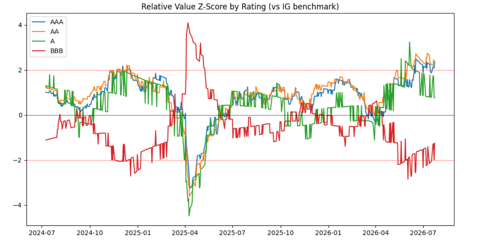
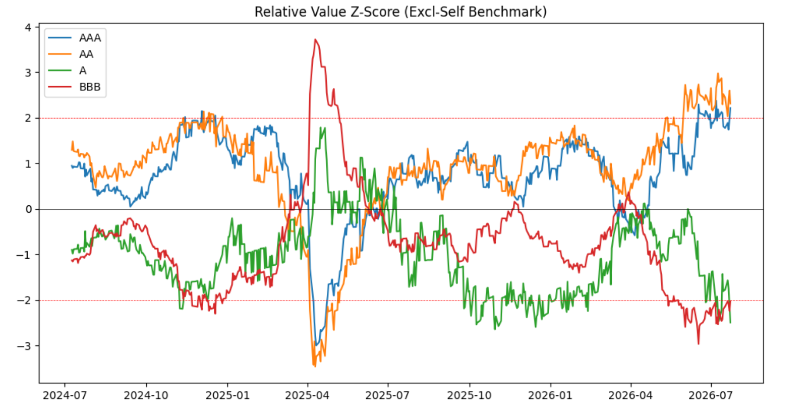

# IG Credit Relative Value Screener

A relative value screener for Investment Grade (IG) corporate bond rating buckets (AAA, AA, A, BBB), built using rolling z-scores to flag cheap/rich signals and generate ranked trade ideas — modeling the relative valuation and screener workflow of a credit trading desk.

## Objective

Systematically identify which IG rating buckets are trading cheap or rich relative to their peers, and produce a ranked, interpretable trade-idea output.

## Data & Core Concepts

**Source:** FRED (Federal Reserve Economic Data) — ICE BofA US Corporate Index OAS series by rating bucket (AAA, AA, A, BBB) plus the overall IG index, daily data.

**Why spread, not price?** Bond prices move constantly due to interest rate changes — that's a rates effect, not a credit signal. Spread (the extra yield a corporate bond pays over a duration-matched risk-free government bond) isolates the credit-risk component.

**Why OAS?** Option-Adjusted Spread removes distortion from embedded call/put options, giving a cleaner, apples-to-apples spread comparison across issuers and structures.

## Methodology

### Version 1 — Naive Benchmark (vs. blended IG index)

For each rating: compute `rating_spread - IG_spread`, then take a rolling 252-day (1 trading year) z-score of that relationship. Z-score above +2 flags "cheap"; below -2 flags "rich."




**Flaw identified:** The IG benchmark is a blend that includes every rating being measured against it — including itself. When BBB spreads spike sharply (BBB has higher "spread beta," reacting more violently to stress), it pulls the whole IG blend upward, mechanically making AAA/AA look artificially "cheap" against a contaminated benchmark. This is a benchmark construction bias, not a genuine signal.

### Version 2 — Excl-Self Benchmark (Fix)

For each rating, built a custom peer benchmark as the simple average of the *other three* ratings only (e.g., AAA's benchmark = mean(AA, A, BBB)), removing the circularity. Re-ran the same rolling z-score methodology on `rating_spread - excl_self_benchmark`.



**Finding:** The mirror-image effect softened but did not disappear — because it isn't purely a benchmark artifact. AAA/AA move together as a "high-quality cluster," and A/BBB move together as a "lower/mid-quality cluster," trading inversely to each other. This reflects a real market phenomenon: **flight-to-quality rotation**, where capital rotates between quality tiers during shifting risk sentiment.

## Final Output

| Rating | Current Spread | Z-score (excl-self) | Signal |
|--------|-----------------|----------------------|--------|
| AA     | 0.57            | +2.31                | CHEAP (Buy candidate) |
| AAA    | 0.43            | +2.21                | CHEAP (Buy candidate) |
| BBB    | 0.98            | -2.04                | RICH (Avoid/Sell candidate) |
| A      | 0.66            | -2.50                | RICH (Avoid/Sell candidate) |

Full output: [`outputs/trade_ideas_latest.csv`](outputs/trade_ideas_latest.csv)

**Interpretation:** High-quality credit (AAA/AA) is currently trading cheap relative to its peer basket, while lower-quality IG (A/BBB) is trading rich — consistent with a flight-to-quality rotation, where investors have bid up A/BBB while relatively neglecting AAA/AA.

## Limitations & Next Steps

- **Rating-bucket level, not single-bond.** A real desk would translate this into issuer-level calls. Natural extension: pull issuer-level spread data (e.g., FINRA TRACE) and apply the same framework per-CUSIP within each rating bucket.
- **Simple average benchmark, not issuance-weighted** — a refinement would weight the peer benchmark by market cap/outstanding issuance per bucket.
- **Rating-cluster correlation is expected, not a bug** — a further extension could explicitly model this via a factor model rather than treating each rating as fully independent.

## Tech Stack

Python, pandas, NumPy, matplotlib, FRED API (`fredapi`)

## How to Run

```bash
pip install -r requirements.txt
export FRED_API_KEY='your_key_here'
python ig_credit_relative_value_screener.py
```
